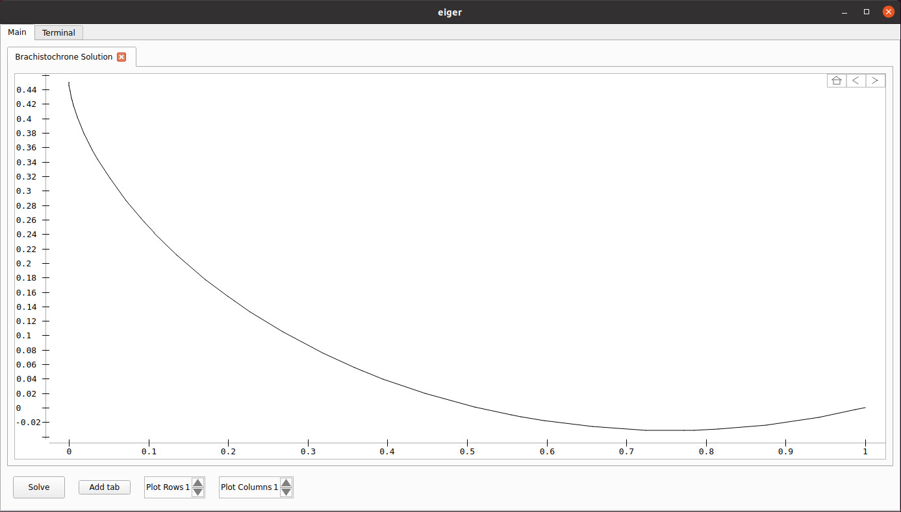
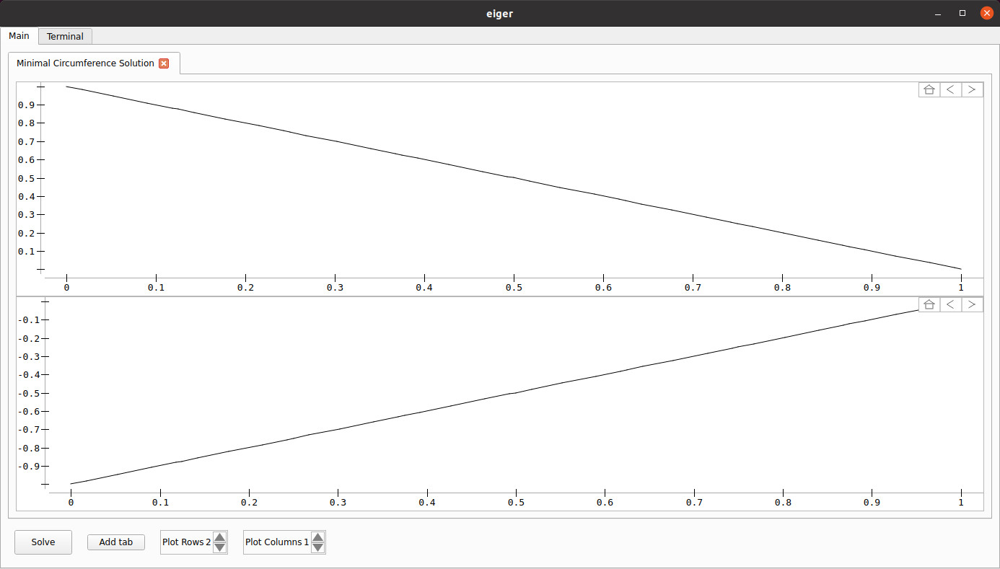

## Eiger
Eiger is a multi-phase trajectory optimization solver that uses the pseudo-spectral method to turn the optimization problem into a nonlinear program. The nonlinear program is currently solved by Ipopt, but other solvers may be supported in the future.  
Ideally, Ipopt is provided gradient information about the objective and the constraints. Other trajectory optimization programs let Ipopt compute this information based on finite differences or by using automatic differentiation, which may not be very efficient. With Eiger, the user defines the dynamics as well as the constraints in a very easy-to-learn manner in Maxima code. Maxima is then used to derive analytical expressions of the gradients. Lastly, C++ code is generated from these expressions, which can later be optimizated by the C++ compiler.  
Eiger also offers a graphical user interface, which allows the user to conveniently visualize solution data.

### Examples
#### Brachistochrone
Consider the xy-plane and let there be two distinct points. The Brachistochrone refers to the problem of finding the path, which, when turned into a marble run, is such that there would be no other marble run connecting the points, which causes the marble to reach the lower point faster when being let loose at the upper end.  
The solution of the Brachistochrone solved with Eiger is shown below.

  

#### Minimal circumference
Consider the xy-plane and let there be two distinct points along the y-axis. In order to demonstrate the multi-phase capabilities of Eiger, imagine there to be two movable points that start at the previously mentioned points at t=0. Suppose that these points can freely move in the xy-plane until some final time t=tf. At t=tf, their x-coordinates shall both be some non-zero value x=xf and their y-coordinates shall be the same as well.  
While the two points could be regarded as a single system with four states, being the x and y-coordinates, the problem will be regarded as a two-phase problem, where in each phase only movable dot is considered. In each phase, the starting point as well as the final x-coordinate are introduced as constraints. An additional constraint imposes that the final y-coordinates in both phases shall be the same.  
The objective is to minimize the integrated squared absolute velocity of the dots during their respective phases. It should not be hard to see that the starting points together with the final point of the optimal solution form an isosceles triangle. The solution of this problem solved with Eiger is shown below.

  

### Dependencies
Eiger was compiled with the Intel® oneAPI Toolkit and hence requires the respective shared libraries to be available to the dynamic linker.

### 3rd party licensing
#### Legendre-Gauss-{Radau|Lobatto} nodes and weights
eiger uses derived work from the software "Legende-Gauss-Lobatto nodes and weights" and "Legende-Gauss-Radau Nodes and Weights" by Greg von Winckel originally available at 
https://ch.mathworks.com/matlabcentral/fileexchange/4775-legende-gauss-lobatto-nodes-and-weights 
https://ch.mathworks.com/matlabcentral/fileexchange/4850-legende-gauss-radau-nodes-and-weights 
The use of this software is covered by the license found in `licenses/Legendre-Gauss`.

#### Qt
eiger uses Qt under the LGPLv3 license. See https://www.qt.io/ or contact felix.crazzolara[at]gmail.com for information on how to obtain a copy of the Qt source code.

#### Eigen
eiger uses the MPL 2.0-licensed features of Eigen, a C++ template library for linear algebra.
A copy of the MPL 2.0 license is available at https://www.mozilla.org/en-US/MPL/2.0/.
The source code of Eigen can be obtained at https://eigen.tuxfamily.org/.

#### sanji
eiger uses the MPL 2.0-licensed features of sanji, a C++ library for visualization.
A copy of the MPL 2.0 license is available at https://www.mozilla.org/en-US/MPL/2.0/.
The source code of sanji can be obtained at https://github.com/felixcrazzolara/sanji.

#### TCLAP
eiger uses TCLAP (Templatized C++ Command Line Parser Library) under the MIT license.

#### cpp_script
eiger uses the MPL 2.0-licensed features of cpp_script, a C++ template library bringing Python features to C++.
A copy of the MPL 2.0 license is available at https://www.mozilla.org/en-US/MPL/2.0/.
The source code of cpp_script can be obtained at https://github.com/felixcrazzolara/cpp_script.

#### Ipopt
eiger uses Ipopt under the EPL-2.0 license. The source code of Ipopt can be obtained at https://github.com/coin-or/Ipopt.

#### Maxima
eiger uses Maxima under the GPL license. See https://maxima.sourceforge.io/ for instructions on how to receive the Maxima source code and to how to install Maxima.
